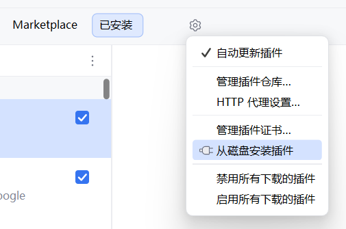

#  Input Tips

A plugin for IntelliJ IDEA on Windows.  
It provides a status bar widget to show the input tips.  
一款IDEA插件，用于在状态栏显示输入法语言状态提示。<b>仅限 Windows</b>

> 由于日常习惯**自动隐藏Windows的任务栏**，但是看不到输入法状态，
> ~~而`Smart Input Pro`等~~市场其它插件不能满足需求，就一鼓作气开发了一个插件~~玩具~~

例如（中文）：  

---
已完成：
- [x] 使用`icon`或`文字`实时显示/更新状态
- [x] 可检测并显示`英文`*蓝色*，`中文`*红色*，`大写锁定`*黄色* 的图标
- [x] 支持Windows
  
计划中：
- [ ] ~~支持 MacOS~~
- [ ] 设置自定义文字和图标
- [ ] 可自动更新光标颜色
- [ ] 上架 Marketplace

## 😋 开始
> [!NOTE]  
> 目前仅支持**Windows**平台
1. 打开`IntelliJ IDEA`-`设置`-`插件`-`齿轮图标`-`从磁盘安装插件`
    >
2. 选择此插件`.zip`
3. 启用插件，若不生效则`重启IDE`

## 🗺️ 原理
主逻辑见源码[WindowsInputStateProvider](./src/main/kotlin/io/github/lingerjab/inputtips/state/WindowsInputStateProvider.kt)和[Imm32Util](./src/main/kotlin/io/github/lingerjab/inputtips/win32/Imm32Util.kt)  
总而言之就是使用`JNA`调用`WINAPI`拿到`Imm32`实例，调用`ImmGetConversionStatus`API  
关于解析输入法状态见[IME_ConversionModeValues](https://learn.microsoft.com/en-us/windows/win32/intl/ime-conversion-mode-values)

## ⬇️ 构建&下载
插件`zip`请到 [Github Release](https://github.com/LingerJAB/InputTips-Plugin/releases) 下载  
手动部署请拉取项目`.git`，执行`gradle buildPlugin`
> 若在`idea-sandbox`下测试插件，执行`gradle runIde`（项目`.idea/`中已包含运行配置）